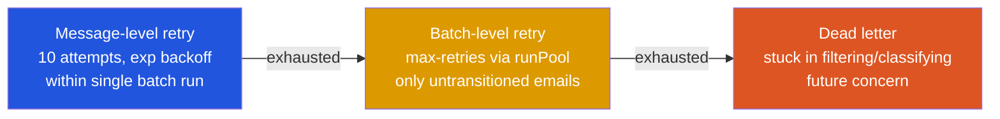
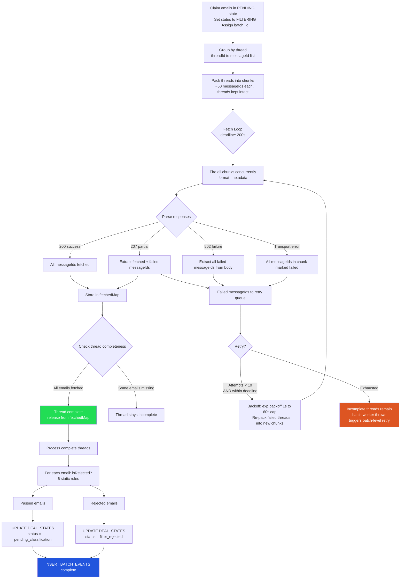
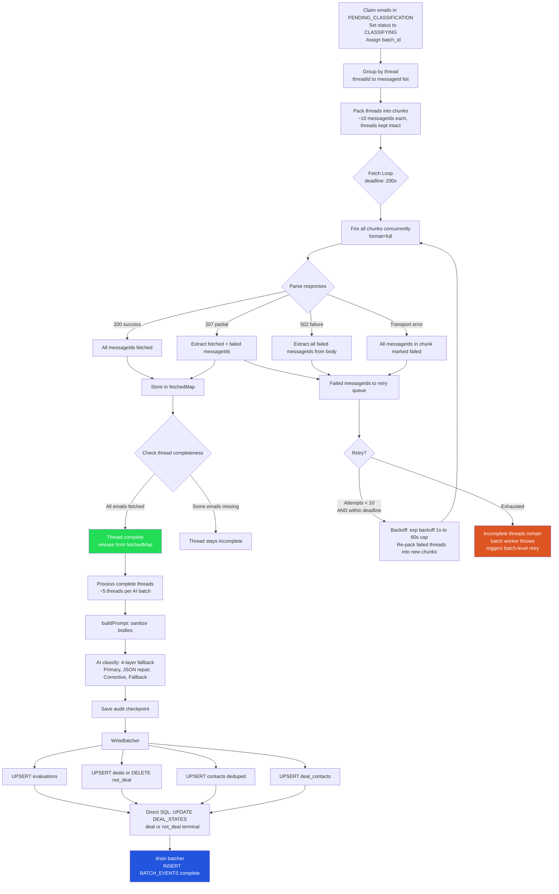
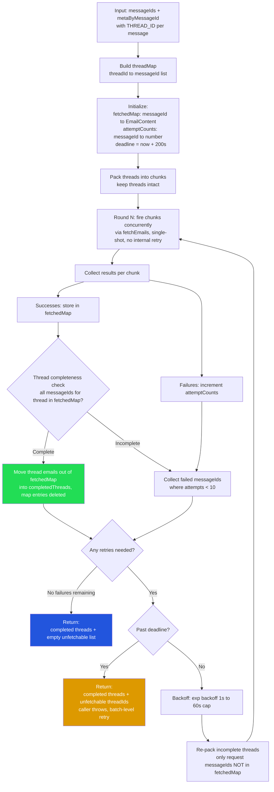
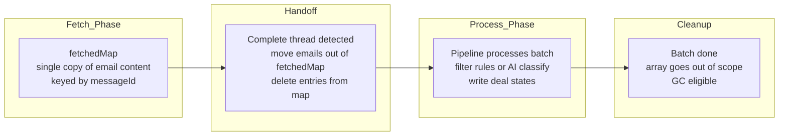

# Content Fetcher Retry - Pipeline Flows

## Retry Levels

```mermaid
flowchart LR
    A["Message-level retry
    10 attempts, exp backoff
    within single batch run"] -->|exhausted| B["Batch-level retry
    max-retries via runPool
    only untransitioned emails"]
    B -->|exhausted| C["Dead letter
    stuck in filtering/classifying
    future concern"]

    style A fill:#25d,color:#fff
    style B fill:#d90,color:#fff
    style C fill:#d52,color:#fff
```

## Filter Pipeline

```mermaid
flowchart TD
    A["Claim emails in PENDING state
    Set status to FILTERING
    Assign batch_id"] --> B["Group by thread
    threadId to messageId list"]
    B --> C["Pack threads into chunks
    ~50 messageIds each, threads kept intact"]
    C --> D{"Fetch Loop
    deadline: 200s"}

    D --> E["Fire all chunks concurrently
    format=metadata"]
    E --> F{Parse responses}

    F -->|200 success| G[All messageIds fetched]
    F -->|207 partial| H[Extract fetched + failed messageIds]
    F -->|502 failure| I[Extract all failed messageIds from body]
    F -->|Transport error| J[All messageIds in chunk marked failed]

    G --> K[Store in fetchedMap]
    H --> K
    H --> L["Failed messageIds to retry queue"]
    I --> L
    J --> L

    K --> M{Check thread completeness}
    M -->|All emails fetched| N["Thread complete
    release from fetchedMap"]
    M -->|Some emails missing| O[Thread stays incomplete]

    L --> P{Retry?}
    P -->|"Attempts < 10
    AND within deadline"| Q["Backoff: exp backoff 1s to 60s cap
    Re-pack failed threads into new chunks"]
    Q --> E
    P -->|Exhausted| R["Incomplete threads remain
    batch worker throws
    triggers batch-level retry"]

    N --> S[Process complete threads]
    S --> T["For each email: isRejected?
    6 static rules"]
    T --> U[Passed emails]
    T --> V[Rejected emails]

    U --> W["UPDATE DEAL_STATES
    status = pending_classification"]
    V --> X["UPDATE DEAL_STATES
    status = filter_rejected"]
    W --> Y[INSERT BATCH_EVENTS complete]
    X --> Y

    style N fill:#2d5,color:#fff
    style R fill:#d52,color:#fff
    style Y fill:#25d,color:#fff
```

## Classify Pipeline

```mermaid
flowchart TD
    A["Claim emails in PENDING_CLASSIFICATION
    Set status to CLASSIFYING
    Assign batch_id"] --> B["Group by thread
    threadId to messageId list"]
    B --> C["Pack threads into chunks
    ~10 messageIds each, threads kept intact"]
    C --> D{"Fetch Loop
    deadline: 200s"}

    D --> E["Fire all chunks concurrently
    format=full"]
    E --> F{Parse responses}

    F -->|200 success| G[All messageIds fetched]
    F -->|207 partial| H[Extract fetched + failed messageIds]
    F -->|502 failure| I[Extract all failed messageIds from body]
    F -->|Transport error| J[All messageIds in chunk marked failed]

    G --> K[Store in fetchedMap]
    H --> K
    H --> L["Failed messageIds to retry queue"]
    I --> L
    J --> L

    K --> M{Check thread completeness}
    M -->|All emails fetched| N["Thread complete
    release from fetchedMap"]
    M -->|Some emails missing| O[Thread stays incomplete]

    L --> P{Retry?}
    P -->|"Attempts < 10
    AND within deadline"| Q["Backoff: exp backoff 1s to 60s cap
    Re-pack failed threads into new chunks"]
    Q --> E
    P -->|Exhausted| R["Incomplete threads remain
    batch worker throws
    triggers batch-level retry"]

    N --> S["Process complete threads
    ~5 threads per AI batch"]
    S --> T["buildPrompt: sanitize bodies"]
    T --> U["AI classify: 4-layer fallback
    Primary, JSON repair, Corrective, Fallback"]
    U --> V[Save audit checkpoint]

    V --> W[WriteBatcher]
    W --> W1[UPSERT evaluations]
    W --> W2[UPSERT deals or DELETE not_deal]
    W --> W3[UPSERT contacts deduped]
    W --> W4[UPSERT deal_contacts]

    W1 & W2 & W3 & W4 --> X["Direct SQL: UPDATE DEAL_STATES
    deal or not_deal terminal"]
    X --> Y["drain batcher
    INSERT BATCH_EVENTS complete"]

    style N fill:#2d5,color:#fff
    style R fill:#d52,color:#fff
    style Y fill:#25d,color:#fff
```

## Fetch Loop Detail - shared by both pipelines

```mermaid
flowchart TD
    A["Input: messageIds + metaByMessageId
    with THREAD_ID per message"] --> B["Build threadMap
    threadId to messageId list"]
    B --> C["Initialize:
    fetchedMap: messageId to EmailContent
    attemptCounts: messageId to number
    deadline = now + 200s"]
    C --> D["Pack threads into chunks
    keep threads intact"]

    D --> E["Round N: fire chunks concurrently
    via fetchEmails, single-shot, no internal retry"]

    E --> F[Collect results per chunk]
    F --> G["Successes: store in fetchedMap"]
    F --> H["Failures: increment attemptCounts"]

    G --> I{"Thread completeness check
    all messageIds for thread in fetchedMap?"}
    I -->|Complete| J["Move thread emails out of fetchedMap
    into completedThreads, map entries deleted"]
    I -->|Incomplete| K["Collect failed messageIds
    where attempts < 10"]

    H --> K

    K --> L{Any retries needed?}
    L -->|No failures remaining| M["Return:
    completed threads + empty unfetchable list"]
    L -->|Yes| N{Past deadline?}
    N -->|Yes| O["Return:
    completed threads + unfetchable threadIds
    caller throws, batch-level retry"]
    N -->|No| P["Backoff: exp backoff 1s to 60s cap"]
    P --> Q["Re-pack incomplete threads
    only request messageIds NOT in fetchedMap"]
    Q --> E

    J --> L

    style J fill:#2d5,color:#fff
    style O fill:#d90,color:#fff
    style M fill:#25d,color:#fff
```

## Memory Management

```mermaid
flowchart LR
    subgraph Fetch_Phase
        A["fetchedMap
        single copy of email content
        keyed by messageId"]
    end

    subgraph Handoff
        B["Complete thread detected
        move emails out of fetchedMap
        delete entries from map"]
    end

    subgraph Process_Phase
        C["Pipeline processes batch
        filter rules or AI classify
        write deal states"]
    end

    subgraph Cleanup
        D["Batch done
        array goes out of scope
        GC eligible"]
    end

    A --> B --> C --> D
```
